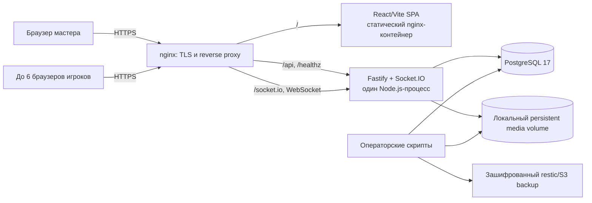
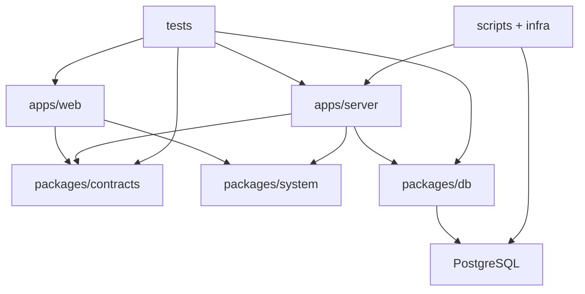
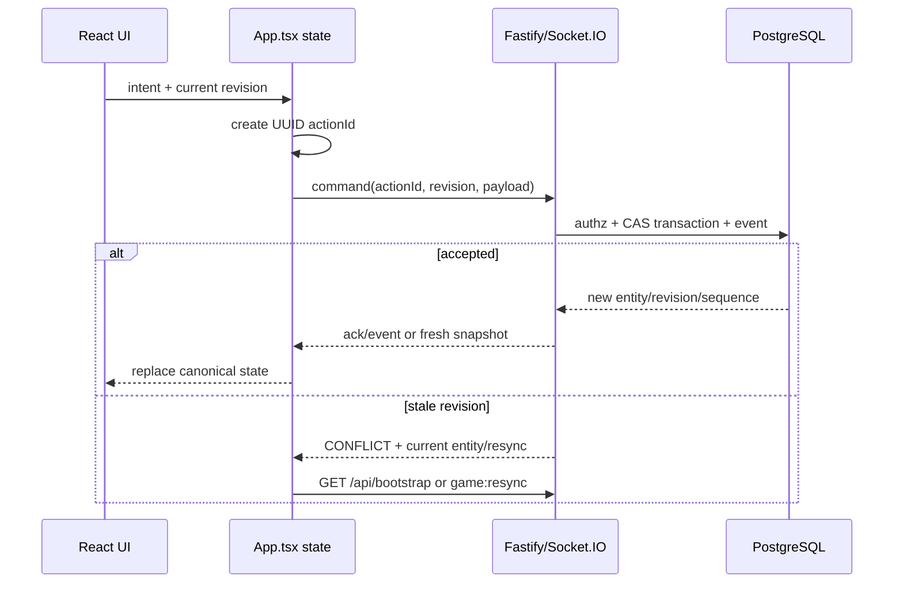

# Архитектура Arken Space

Документ описывает фактическое устройство проекта на ревизии
`abcb2efc25e8e9664fdf2becd66b9645e22f82ae` от 2026-07-19. Продуктовые
решения и причины их принятия вынесены в
[architecture-decisions-2026-07-14.md](./architecture-decisions-2026-07-14.md),
а найденные при чтении кода ограничения — в
[codebase-audit.md](./codebase-audit.md).

## Назначение и границы

Arken Space — приватный web-first virtual tabletop для одного мастера и до
шести игроков. Текущий поддерживаемый сценарий — одна кампания, desktop-браузеры,
одна активная ортографическая 2D-сцена, квадратная сетка, токены, ручной туман
войны, рисунки, персонажи, чат, серверные броски и синхронизированная музыка.

Isometric/3D, несколько одновременно активных уровней, публичная регистрация,
голос/видео, offline mode и горизонтальное масштабирование пока не входят в
реализованную архитектуру.

## Контекст выполнения

В production наружу смотрит nginx. Контейнеры web и server публикуют только
loopback-порты; PostgreSQL доступен внутри Compose-сети. Сервер хранит durable
состояние в PostgreSQL, а бинарные изображения и аудио — в локальном каталоге,
смонтированном с хоста. Backup объединяет дамп БД, checksums медиа и удалённый
restic-репозиторий.

Это single-instance архитектура. Socket.IO rooms, presence и connection
recovery живут в памяти одного процесса, а shared Socket.IO adapter и общее
object storage отсутствуют.

## Монорепозиторий и зависимости

Проект — strict TypeScript/ESM монорепозиторий на pnpm workspaces.

| Область              | Ответственность                                               | Основные точки входа                               |
| -------------------- | ------------------------------------------------------------- | -------------------------------------------------- |
| `apps/web`           | SPA, локальное UI-состояние, canvas, REST/Socket.IO-клиенты   | `src/main.tsx`, `src/App.tsx`, `src/Sidebar.tsx`   |
| `apps/server`        | HTTP/WS transport, auth/authz, use cases, snapshots, media    | `src/index.ts`, `src/routes.ts`, `src/realtime.ts` |
| `packages/contracts` | Общие Zod input-схемы, DTO и typed Socket.IO events           | `src/index.ts`                                     |
| `packages/system`    | Определение Arken Core и starter character                    | `src/index.ts`                                     |
| `packages/db`        | Drizzle schema, connection factory и SQL migrations           | `src/schema.ts`, `src/index.ts`, `src/migrate.ts`  |
| `tests`              | Vitest/PGlite, HTTP/realtime integration, Playwright          | `vitest.config.ts`, `playwright*.config.ts`        |
| `scripts`, `infra`   | Deploy, backup/restore, reset, incident bundle, nginx/systemd | `docker-compose*.yml`, `infra/**`, `scripts/**`    |

Направление зависимостей в целом правильное: web не импортирует server/db, а
общие wire-контракты находятся отдельно. При этом backend application layer пока
не разделён на controllers/services/repositories: `routes.ts` напрямую выполняет
валидацию, authorization, Drizzle-запросы, транзакции, аудит и broadcast.

## Главные архитектурные инварианты

1. **Сервер авторитетен.** Клиент может показывать optimistic preview движения,
   но финальные координаты, броски, права, ревизии и общий audio state принимает
   сервер.
2. **Все данные scoped кампанией на уровне application code.** Большинство
   запросов проверяет `campaignId`; составных tenant-aware foreign keys в БД нет,
   поэтому эту проверку нельзя опускать в новых use cases.
3. **Секреты не хранятся открытым текстом.** Session, invite и persistent player
   access tokens представлены SHA-256 hashes; raw access secret возвращается
   только при создании или ротации.
4. **PLAYER получает проекцию, а не полный объектный граф.** `buildSnapshot`
   отфильтровывает сцены, персонажей, токены, определения, сообщения и assets;
   GM получает полную проекцию кампании.
5. **Durable-команды должны быть идемпотентны.** Клиент создаёт UUID `actionId`,
   а уникальность `(campaignId, actionId)` в `game_events` защищает от повторного
   применения после retry/reconnect.
6. **Изменяемые сущности используют optimistic concurrency.** Клиент передаёт
   `revision`, сервер выполняет compare-and-swap и возвращает conflict при
   устаревшей версии.
7. **State и event log — разные вещи.** Текущие значения лежат в обычных
   таблицах. `game_events` нужен для аудита, sequence/idempotency и версии
   snapshot, но проект не является event-sourced системой.
8. **Canvas undo/redo durable.** `action_journal` хранит before/after и отдельное
   состояние `APPLIED`, `UNDONE` или `INVALIDATED`; новая команда инвалидирует
   соответствующую redo-ветку.

## Сервер

### Startup pipeline

`apps/server/src/index.ts`:

1. Валидирует environment через Zod.
2. Создаёт Fastify с CORS, cookies, multipart и HTTP rate limit.
3. Для unsafe HTTP methods отклоняет присутствующий `Origin`, если он не равен
   `WEB_ORIGIN`; запрос без заголовка `Origin` сейчас допускается.
4. Открывает PostgreSQL и выполняет `ensureSeed`.
5. Поднимает Socket.IO с cookie auth и recovery window 120 секунд.
6. Регистрирует realtime handlers и HTTP routes.
7. Закрывает Socket.IO и DB pool на shutdown.

`ensureSeed` создаёт первую кампанию, GM membership, сцену, персонажа и audio
state. Это bootstrap для текущего single-campaign режима, а не полноценный
multi-campaign provisioning service.

### HTTP API по доменам

| Домен              | Маршруты                                                                                                  |
| ------------------ | --------------------------------------------------------------------------------------------------------- |
| Auth/bootstrap     | `/api/auth/*`, `/api/bootstrap`, `/api/diagnostics`, `/api/preview/:membershipId`                         |
| Membership/access  | rename membership, legacy invite, list/revoke/rotate persistent player access                             |
| Characters/catalog | character CRUD, campaign catalog, assignment snapshots, counters, recharge, roll                          |
| Scenes/canvas      | scene metadata/activation/config, definitions, placements, layers, fog, drawings, bulk, history/undo/redo |
| Communication      | chat, dice, campaign clock, synchronized audio                                                            |
| Media/feedback     | asset upload/content, public suggestions, authenticated reports, client logs                              |

Подробные request-схемы являются экспортами `@arken/contracts`. REST response и
error shapes централизованы не полностью, поэтому при добавлении endpoint нужно
проверять не только Zod input, но и фактический ответ/ошибки в существующих
тестах.

### Realtime

Socket после аутентификации входит в комнаты:

- `campaign:<campaignId>`;
- `member:<membershipId>`;
- `campaign:<campaignId>:gm` для мастера.

При подключении и явном `game:resync` сервер посылает полный role-filtered
`GameSnapshot`. Durable realtime-команды — `token:moved` и `audio:set`; они имеют
ack, `actionId`, revision checks, DB transaction и `game_events`. `token:moving`,
`ruler:*` и `map:ping` — эфемерные события и в БД не сохраняются.

Большинство HTTP mutations вызывает полный snapshot broadcast каждому socket,
а token/audio/chat/fog частично используют точечные events. Это гибридная модель:
клиент должен уметь принять как incremental event, так и канонический snapshot.

### Snapshot и видимость

`buildSnapshot` параллельно загружает campaign, memberships, characters, scenes,
token definitions/placements/controllers, catalog, fog, drawings, assets,
последние 200 chat messages, audio и максимальную event sequence.

Для PLAYER остаются только:

- активная сцена;
- его membership и принадлежащий ему персонаж;
- видимые non-GM placements активной сцены;
- token definitions, которыми он управляет;
- fog/drawings активной сцены;
- public chat и собственные `GM_ONLY` сообщения;
- referenced assets и собственные TOKEN/PORTRAIT uploads;
- общий выбранный audio asset/state.

Туман войны — визуальный механизм canvas, не самостоятельная граница
конфиденциальности. Секретность достигается тем, что GM-layer tokens и закрытые
объекты вообще не попадают в player snapshot.

## Клиент

`main.tsx` настраивает Gravity UI, русскую локаль, dark theme, toaster и error
boundary. `App.tsx` — composition root: загружает `/api/bootstrap`, хранит
канонический `GameSnapshot`, подключает Socket.IO, применяет incremental events,
организует optimistic mutations и передаёт callbacks в sidebar/renderer.

Основные части:

- `AuthGate.tsx` — landing и вход через `/gm/<token>`, `/join/<token>` или
  временный `/play/<handle>`;
- `Sidebar.tsx` — роли, персонажи, каталог, чат, токены, сцены, музыка и
  GM/player workflows;
- `Orthographic2DRenderer.tsx` — React-Konva сцена, zoom/pan, grid, tokens,
  drawings, ordered fog, ruler и pings;
- `api.ts` — `fetch` wrapper, JSON/errors, `x-action-id`, безопасная диагностика;
- `realtime.ts` — typed Socket.IO client;
- `MusicBar.tsx` — серверный audio state плюс локальные consent/volume;
- `FeedbackReporter.tsx` — отчёт с allowlisted diagnostics/screenshots;
- `ui/**` — диалоги, формы и entity conflict state.

Глобального state manager и router library нет. Навигация для auth читается из
`window.location.pathname`, а игровое состояние сосредоточено в React hooks
внутри `App`. Canvas renderer лениво импортируется отдельным chunk.

### Поток mutation на клиенте

## Данные

Drizzle schema содержит 21 прикладную таблицу.

| Группа              | Таблицы                                                                                 |
| ------------------- | --------------------------------------------------------------------------------------- |
| Campaign/auth       | `campaigns`, `memberships`, `invites`, `player_access_grants`, `sessions`               |
| Characters/catalog  | `characters`, `catalog_entries`, `character_catalog_entries`                            |
| Canvas              | `scenes`, `token_definitions`, `token_controllers`, `tokens`, `fog_reveals`, `drawings` |
| Media/audio         | `assets`, `audio_states`                                                                |
| Communication/audit | `chat_messages`, `game_events`, `action_journal`                                        |
| Feedback            | `feedback_reports`, `feedback_attachments`                                              |

Ключевые отношения:

- campaign агрегирует всю игровую модель;
- membership имеет sessions/access grants и может владеть character;
- catalog template копируется в независимый character-owned entry;
- token definition хранит повторно используемую идентичность и many-to-many
  controllers, а token — placement и revision на конкретной сцене;
- fog — упорядоченная последовательность `REVEAL`/`COVER`;
- assets лежат в БД как metadata, а content — на файловой системе;
- `game_events` и `action_journal` обеспечивают разные виды истории.

Миграции `0000`–`0015` применяются при старте server-контейнера до запуска
Fastify. Изменение schema обязано сопровождаться migration, тестами, обновлением
backup/restore manifests и проверкой role-filtered snapshot.

## Эксплуатация и восстановление

Production Compose содержит PostgreSQL 17, server и статический web. Server
health сообщает DB, build revision и schema version. Логи ограничены пятью
файлами по 10 MiB на сервис.

Nightly backup создаёт custom `pg_dump`, table-count manifest, checksum dump и
каждого media-файла, затем отправляет всё в encrypted restic/S3. Restore rehearsal
работает только в отдельном `arken-restore-*` Compose project без published ports
и production mounts. Gameplay reset — отдельный operator-only workflow с fresh
backup, rehearsal, typed confirmation и receipt.

Подробности: [operations.md](./operations.md),
[deployment.md](./deployment.md) и
[production-release-checklist.md](./production-release-checklist.md).

## Где расширять систему

| Изменение              | Обязательные места                                                                                    |
| ---------------------- | ----------------------------------------------------------------------------------------------------- |
| Новый command/use case | contracts → route/realtime → DB transaction/event → snapshot/event handler → tests                    |
| Новое поле сущности    | Drizzle schema → migration/metadata → DTO/Zod → serializer → UI → backup/reset assumptions → tests    |
| Новый realtime event   | обе event maps → server emit/audience → client listener/dedupe → reconnect test                       |
| Новый canvas tool      | renderer props/interaction → App mutation → server authz/CAS → journal → visibility/multiplayer tests |
| Новый asset kind       | contract/enum → DB migration → upload validation/storage → visibility/content route → backup/tests    |
| Новое правило RPG      | `packages/system` + contracts → server resolution → character/catalog UI → system/dice tests          |

Перед изменениями рекомендуется прочитать
[development-guide.md](./development-guide.md) и
[skills-matrix.md](./skills-matrix.md).
