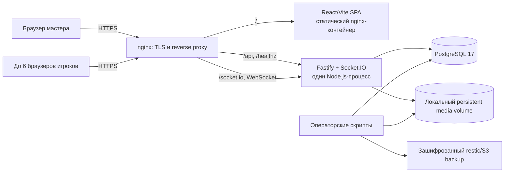
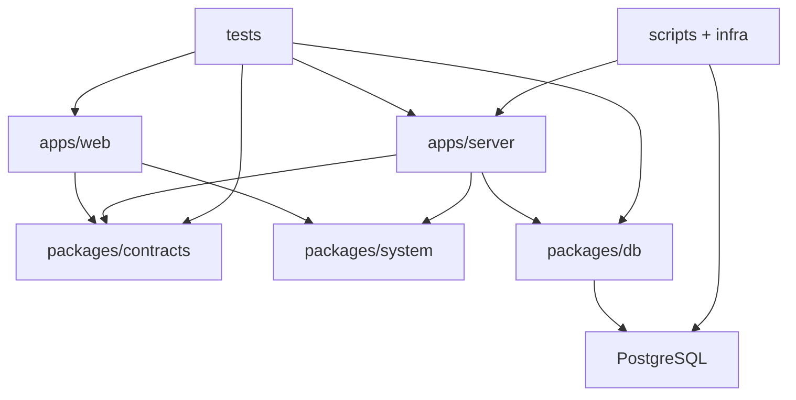
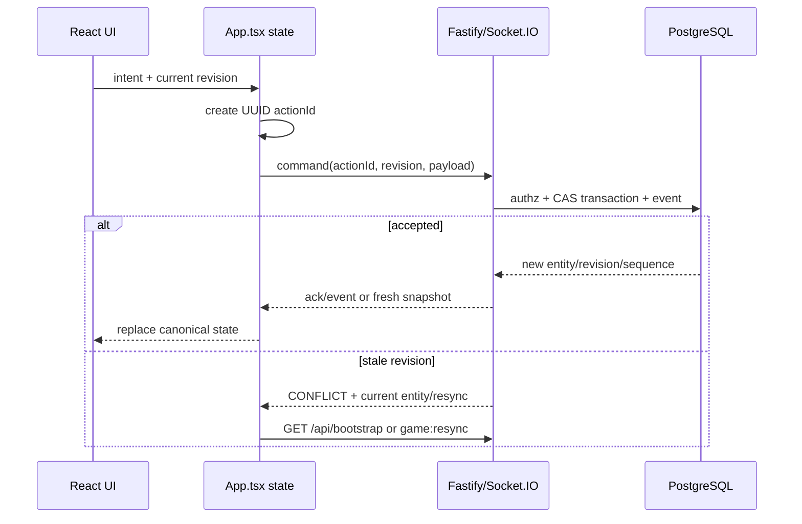

# Архитектура Arken Space

Документ сверялся с фактическим устройством проекта на ревизии
`42c7ccc` от 2026-08-20 (та же ревизия была подтверждена production
`/healthz`). Продуктовые решения и
причины их принятия вынесены в
[architecture-decisions-2026-07-14.md](./architecture-decisions-2026-07-14.md),
а найденные при чтении кода ограничения — в
[codebase-audit.md](./codebase-audit.md).

> Документ описывает **как есть**, а не как задумано. Если код и этот текст
> расходятся — прав код, а расхождение стоит починить здесь же. Числа ниже
> (таблицы, маршруты, миграции) проверяются командами из
> [development-guide.md](./development-guide.md#проверить-факты-из-архитектуры),
> а не переписываются на глаз.

## Назначение и границы

Arken Space — приватный web-first virtual tabletop для одного мастера и до
шести игроков. Текущий поддерживаемый сценарий — одна кампания, desktop-браузеры,
одна активная ортографическая 2D-сцена, квадратная сетка, токены, туман войны
произвольной формы, рисунки, персонажи, чат (общий, личные треды, стикеры),
серверные броски, каталог навыков и способностей, карты мира с положением
партии, сюжетный канал, заявки игроков, столкновения и синхронизированная
музыка.

Isometric/3D, несколько одновременно активных уровней, публичная регистрация,
голос/видео, offline mode и горизонтальное масштабирование пока не входят в
реализованную архитектуру.

## Контекст выполнения

```mermaid
flowchart LR
  GM["Браузер мастера"]
  Players["До 6 браузеров игроков"]
  Edge["nginx: TLS и reverse proxy"]
  Web["React/Vite SPA\nстатический nginx-контейнер"]
  Server["Fastify + Socket.IO\nодин Node.js-процесс"]
  DB[("PostgreSQL 17")]
  Media[("Локальный persistent media volume")]
  Operator["Операторские скрипты"]
  Backup["Зашифрованный restic/S3 backup"]

  GM -->|HTTPS| Edge
  Players -->|HTTPS| Edge
  Edge -->|/| Web
  Edge -->|/api, /healthz| Server
  Edge -->|/socket.io, WebSocket| Server
  Server --> DB
  Server --> Media
  Operator --> DB
  Operator --> Media
  Operator --> Backup
```

В production наружу смотрит nginx. Контейнеры web и server публикуют только
loopback-порты; PostgreSQL доступен внутри Compose-сети. Сервер хранит durable
состояние в PostgreSQL, а бинарные изображения и аудио — в локальном каталоге,
смонтированном с хоста. Backup объединяет дамп БД, checksums медиа и удалённый
restic-репозиторий.

Это single-instance архитектура. Socket.IO rooms, presence и connection
recovery живут в памяти одного процесса, а shared Socket.IO adapter и общее
object storage отсутствуют.

## Монорепозиторий и зависимости

Проект — strict TypeScript/ESM монорепозиторий на pnpm workspaces.

```mermaid
flowchart TD
  Web["apps/web"] --> Contracts["packages/contracts"]
  Web --> System["packages/system"]
  Server["apps/server"] --> Contracts
  Server --> System
  Server --> DB["packages/db"]
  DB --> Postgres["PostgreSQL"]
  Tests["tests"] --> Web
  Tests --> Server
  Tests --> Contracts
  Tests --> DB
  Ops["scripts + infra"] --> Server
  Ops --> Postgres
```

| Область              | Ответственность                                               | Основные точки входа                               |
| -------------------- | ------------------------------------------------------------- | -------------------------------------------------- |
| `apps/web`           | SPA, локальное UI-состояние, canvas, REST/Socket.IO-клиенты   | `src/main.tsx`, `src/App.tsx`, `src/Sidebar.tsx`   |
| `apps/server`        | HTTP/WS transport, auth/authz, use cases, snapshots, media    | `src/index.ts`, `src/routes.ts`, `src/realtime.ts` |
| `packages/contracts` | Общие Zod input-схемы, DTO и typed Socket.IO events           | `src/index.ts`                                     |
| `packages/system`    | Определение Arken Core и starter character                    | `src/index.ts`                                     |
| `packages/db`        | Drizzle schema, connection factory и SQL migrations           | `src/schema.ts`, `src/index.ts`, `src/migrate.ts`  |
| `tests`              | Vitest/PGlite, HTTP/realtime integration, Playwright          | `vitest.config.ts`, `playwright*.config.ts`        |
| `scripts`, `infra`   | Deploy, backup/restore, reset, incident bundle, nginx/systemd | `docker-compose*.yml`, `infra/**`, `scripts/**`    |

Направление зависимостей в целом правильное: web не импортирует server/db, а
общие wire-контракты находятся отдельно. При этом backend application layer пока
не разделён на controllers/services/repositories: `routes.ts` напрямую выполняет
валидацию, authorization, Drizzle-запросы, транзакции, аудит и broadcast.

## Главные архитектурные инварианты

1. **Сервер авторитетен.** Клиент может показывать optimistic preview движения,
   но финальные координаты, броски, права, ревизии и общий audio state принимает
   сервер.
2. **Все данные scoped кампанией на уровне application code.** Большинство
   запросов проверяет `campaignId`; составные tenant-aware foreign keys защищают
   только часть связей, поэтому application predicate нельзя опускать в новых
   use cases. Runtime-инвентарь `campaign-isolation-routes.test.ts` требует
   классифицировать каждый URL с `:id`/`:*Id`, а двухкампанейные HTTP-probes
   доказывают отказ для каждого пути с точным сегментом `:id`. Исключения закрыты
   двумя доменными политиками: глобальный канонический World Content и
   operator-only feedback.
3. **Секреты не хранятся открытым текстом.** Session, invite и persistent player
   access tokens представлены SHA-256 hashes; raw access secret возвращается
   только при создании или ротации.
4. **PLAYER получает проекцию, а не полный объектный граф.** `buildSnapshot`
   отфильтровывает сцены, персонажей, токены, определения, сообщения и assets;
   GM получает полную проекцию кампании.
5. **Durable-команды должны быть идемпотентны.** Клиент создаёт UUID `actionId`,
   а уникальность `(campaignId, actionId)` в `game_events` защищает от повторного
   применения после retry/reconnect.
6. **Изменяемые сущности используют optimistic concurrency.** Клиент передаёт
   `revision`, сервер выполняет compare-and-swap и возвращает conflict при
   устаревшей версии.
7. **State и event log — разные вещи.** Текущие значения лежат в обычных
   таблицах. `game_events` нужен для аудита, sequence/idempotency и версии
   snapshot, но проект не является event-sourced системой.
8. **Canvas undo/redo durable.** `action_journal` хранит before/after и отдельное
   состояние `APPLIED`, `UNDONE` или `INVALIDATED`; новая команда инвалидирует
   соответствующую redo-ветку.

## Сервер

### Startup pipeline

`apps/server/src/index.ts`:

1. Валидирует environment через Zod.
2. Создаёт Fastify с CORS, cookies, multipart и HTTP rate limit.
3. Для unsafe HTTP methods отклоняет присутствующий `Origin`, если он не равен
   `WEB_ORIGIN`; запрос без заголовка `Origin` сейчас допускается.
4. Открывает PostgreSQL и выполняет `ensureSeed`.
5. Поднимает Socket.IO с cookie auth и recovery window 120 секунд.
6. Регистрирует realtime handlers и HTTP routes.
7. Закрывает Socket.IO и DB pool на shutdown.

`ensureSeed` создаёт первую кампанию, GM membership, сцену, персонажа и audio
state. Это bootstrap для текущего single-campaign режима, а не полноценный
multi-campaign provisioning service.

### HTTP API по доменам

Всего **145** HTTP-маршрутов во всех server route-модулях: 85 остаются в
`routes.ts`, остальные разделены по персонажам, столкновениям, паузе кампании,
operator feedback, заявкам игроков, сюжетному каналу, картам и содержимому мира.

| Домен              | Маршруты                                                                                                                                                                                                                                                                                                            |
| ------------------ | ------------------------------------------------------------------------------------------------------------------------------------------------------------------------------------------------------------------------------------------------------------------------------------------------------------------- |
| Auth/bootstrap     | `/api/auth/*`, `/api/bootstrap`, `/api/diagnostics`, `/api/preview/:membershipId`                                                                                                                                                                                                                                   |
| Membership/access  | rename membership, legacy invite, list/revoke/rotate persistent player access                                                                                                                                                                                                                                       |
| Characters/catalog | character CRUD, controllers, media, campaign catalog, assignment snapshots, counters, recharge, roll                                                                                                                                                                                                                |
| Scenes/canvas      | scene metadata/activation/config, definitions, placements, layers, fog, drawings, bulk, history/undo/redo, состояния фигур (`/api/tokens/:id/conditions`)                                                                                                                                                           |
| Столкновения       | создание, переходы состояний, применение результатов                                                                                                                                                                                                                                                                |
| Карты мира         | `world-map-routes.ts` — карты, локации, привязка сцен, положение партии                                                                                                                                                                                                                                             |
| Содержимое мира    | `world-content-routes.ts` — шаблоны сущностей мира, экземпляры, действия, связи                                                                                                                                                                                                                                     |
| Кампания           | переименование, часы, server-authoritative pause (`/api/campaign/pause`), раскладка характеристик (`/api/campaign/stat-layout`), очередь ходов (`/api/campaign/initiative` — мастер, `/api/campaign/initiative/self` — своё значение), зона боя (`/api/campaign/battle-zone`, `/api/campaign/initiative/from-zone`) |
| Общение            | чат (общий, треды, история с пагинацией, вложения, курсоры прочтения), стикеры, кубы, синхронная музыка                                                                                                                                                                                                             |
| Сюжетный канал     | посты, ревизии, публикация, архив, пагинация                                                                                                                                                                                                                                                                        |
| Заявки игроков     | создание, редактирование, переходы состояний                                                                                                                                                                                                                                                                        |
| Media/feedback     | загрузка и выдача ассетов, генерация изображения токена, публичные предложения, отчёты, `client-logs`                                                                                                                                                                                                               |

Подробные request-схемы являются экспортами `@arken/contracts`. REST response и
error shapes централизованы не полностью, поэтому при добавлении endpoint нужно
проверять не только Zod input, но и фактический ответ/ошибки в существующих
тестах.

### Realtime

Socket после аутентификации входит в комнаты:

- `campaign:<campaignId>`;
- `member:<membershipId>`;
- `campaign:<campaignId>:gm` для мастера.

При подключении и явном `game:resync` сервер посылает полный role-filtered
`GameSnapshot`. Durable realtime-команды — `token:moved`, `audio:set` и
`audio:track:set`; они имеют ack, `actionId`, revision checks, DB transaction и
`game_events`. Эфемерные события в БД не сохраняются: `token:moving`, `ruler:*`,
`map:ping` и `cursor:*`.

Полный список: клиент шлёт `token:moved`, `token:moving`, `audio:set`,
`audio:track:set`, `map:ping`, `ruler:update`, `ruler:clear`, `cursor:move`,
`cursor:gone`, `scene:view`, `game:resync`; сервер шлёт `game:snapshot`,
`token:moving`, `map:ping`, `ruler:updated`, `ruler:cleared`, `cursor:moved`,
`cursor:gone`, `fog:created`.

`scene:view` (UIX-408) сообщает серверу, какую сцену рассматривает мастер, не
переключая игроков. Без этого знания выборку тумана и рисунков нельзя сузить:
`viewedSceneId` — локальное состояние клиента. Сервер принимает событие только
от мастера, проверяет принадлежность сцены кампании и отвечает свежим
снапшотом **этому одному сокету**. Снапшот везёт канвас активной сцены плюс
рассматриваемой — две сцены из шести вместо всех.

**Курсоры разделены по комнатам намеренно.** Курсор игрока уходит в общую
комнату кампании, курсор ГМ — только в GM-комнату: ГМ видит сквозь туман, и
координаты, по которым ходит его указатель, выдали бы скрытое. Это защитное
решение, а не недоделка — его отмена должна быть осознанной (см. UIX-403).

Большинство HTTP mutations вызывает полный snapshot broadcast каждому socket,
а token/audio/chat/fog частично используют точечные events. Это гибридная модель:
клиент должен уметь принять как incremental event, так и канонический snapshot.

### Snapshot и видимость

`buildSnapshot` параллельно загружает campaign, memberships, characters, scenes,
token definitions/placements/controllers, catalog, fog, drawings, assets,
последние 20 сообщений каждого разрешённого chat-thread, audio и максимальную
event sequence. Более ранняя история загружается отдельным пагинируемым HTTP
маршрутом, а не раздувает каждый realtime snapshot.

Для PLAYER остаются только:

- активная сцена;
- его membership и принадлежащий ему персонаж;
- видимые non-GM placements активной сцены;
- token definitions, которыми он управляет;
- fog/drawings активной сцены;
- public chat и собственные `GM_ONLY` сообщения;
- referenced assets и собственные TOKEN/PORTRAIT uploads;
- общий выбранный audio asset/state.

Туман войны — визуальный механизм canvas, не самостоятельная граница
конфиденциальности. Секретность достигается тем, что GM-layer tokens и закрытые
объекты вообще не попадают в player snapshot.

## Клиент

`main.tsx` настраивает Gravity UI, русскую локаль, dark theme, toaster и error
boundary. `App.tsx` — composition root: загружает `/api/bootstrap`, хранит
канонический `GameSnapshot`, подключает Socket.IO, применяет incremental events,
организует optimistic mutations и передаёт callbacks в sidebar/renderer.

Основные части:

- `AuthGate.tsx` — landing и вход через `/gm/<token>`, `/join/<token>` или
  временный `/play/<handle>`;
- `Sidebar.tsx` — роли, персонажи, каталог, чат, токены, сцены, музыка и
  GM/player workflows;
- `Orthographic2DRenderer.tsx` — React-Konva сцена, zoom/pan, grid, tokens,
  drawings, ordered fog, ruler и pings;
- `api.ts` — `fetch` wrapper, JSON/errors, `x-action-id`, безопасная диагностика;
- `realtime.ts` — typed Socket.IO client;
- `MusicBar.tsx` — серверный audio state плюс локальные consent/volume;
- `FeedbackReporter.tsx` — отчёт с allowlisted diagnostics/screenshots;
- `ui/**` — диалоги, формы и entity conflict state.

Глобального state manager и router library нет. Навигация для auth читается из
`window.location.pathname`, а игровое состояние сосредоточено в React hooks
внутри `App`. Canvas renderer лениво импортируется отдельным chunk.

### Команды: доменные хуки и контекст действий

UIX-398 разделил «действия» и «состояние». Все команды кампании собраны в
доменные хуки `use-*-actions.ts` (сцены, карты мира, токены, чат, доступы,
каталог, сюжет, заявки, ассеты) и раздаются через `CampaignActionsContext`
вместо того, чтобы протаскиваться пропсами через каждый слой. Пропсов у
`Sidebar` стало 26 вместо 83.

**Инвариант, на котором всё держится: в контексте не должно быть ни одного
изменяемого значения.** У React-контекста нет выборочной подписки — при смене
значения перерисовываются все потребители. Это безопасно только потому, что там
лежат исключительно функции, стабильные на всё время жизни компонента, поэтому
значение контекста не меняется никогда. Положите туда `snapshot`, выбранный id
или любое живое значение — гарантия исчезнет молча, приложение продолжит
работать, просто начнёт перерисовывать всё дерево на каждое игровое событие.
Инвариант закреплён тестом `campaign-actions-context.test.tsx`, который обходит
значение и отвергает всё, что не является функцией.

Стабильность обработчиков достигается двумя приёмами:

- обработчик, которому нужно свежее значение, читает его через
  `use-latest-ref.ts`, а не через замыкание с зависимостью. Зависимость от
  `snapshot` пересоздавала бы обработчик на каждое игровое событие — то есть
  ровно тогда, когда стабильность нужнее всего;
- там, где хватает функции-обновителя `setSnapshot((current) => ...)`,
  обработчик вообще не замыкается на состояние и стабилен даром.

Состояние по-прежнему ходит пропсами. Селективные подписки (`useSyncExternalStore`
с селекторами) — этап C в
[app-tsx-decomposition-plan.md](./app-tsx-decomposition-plan.md), намеренно
закрытый до замеров на боевой игре.

### Телеметрия клиента

Два независимых канала, оба в `/api/client-logs`:

- **Ошибки** (`error-reporting.ts`, `error-report-buffer.ts`) — глобальные
  перехватчики ставятся при инициализации модуля, до монтирования React, чтобы
  ловить и падения на старте. Отчёты буферизуются в `localStorage`, схлопываются
  по сигнатуре и переживают перезагрузку: потерянная ошибка невосстановима.
- **Замеры** (`performance-samples.ts`, `performance-reporting.ts`) — `longtask`
  и `event` timing, сведённые в одну запись на окно и отправляемые не чаще раза
  в минуту, и только если есть что показать. Идут **мимо** буфера: он схлопывает
  по сигнатуре, а у всех окон замеров сигнатура одна и различаются они как раз
  числами. Потерянная выборка ничего не стоит, следующая через минуту.

Свободный текст с клиента сервер не логирует никогда: `safeClientMessage`
заменяет сообщение на константу по типу события, а `sanitizeClientContext`
пропускает только ключи из списка. Класс ошибки и кадры стека описывают **код**,
а не данные пользователя, поэтому сохраняются целиком.

### Поток mutation на клиенте

```mermaid
sequenceDiagram
  participant UI as React UI
  participant App as App.tsx state
  participant API as Fastify/Socket.IO
  participant DB as PostgreSQL

  UI->>App: intent + current revision
  App->>App: create UUID actionId
  App->>API: command(actionId, revision, payload)
  API->>DB: authz + CAS transaction + event
  alt accepted
    DB-->>API: new entity/revision/sequence
    API-->>App: ack/event or fresh snapshot
    App-->>UI: replace canonical state
  else stale revision
    API-->>App: CONFLICT + current entity/resync
    App->>API: GET /api/bootstrap or game:resync
  end
```

## Данные

Drizzle schema содержит **51** прикладную таблицу.

| Группа             | Таблицы                                                                                                                                                 |
| ------------------ | ------------------------------------------------------------------------------------------------------------------------------------------------------- |
| Campaign/auth      | `campaigns`, `memberships`, `invites`, `player_access_grants`, `sessions`, `gm_access_credentials`                                                      |
| Characters/catalog | `characters`, `character_controllers`, `character_media`, `catalog_entries`, `character_catalog_entries`, `player_likeness_consents`                    |
| Canvas             | `scenes`, `token_definitions`, `token_controllers`, `tokens`, `fog_reveals`, `drawings`, `encounters`                                                   |
| Карты мира         | `world_maps`, `world_map_locations`, `world_map_location_scenes`, `world_map_party_position`                                                            |
| Содержимое мира    | `world_content`, `world_content_instances`, `world_content_actions`, `world_content_instance_actions`, `world_content_media`, `world_content_relations` |
| Общение            | `chat_messages`, `chat_threads`, `chat_read_cursors`, `chat_attachments`, `chat_attachment_uploads`                                                     |
| Стикеры            | `stickers`, `sticker_packs`, `sticker_pack_entitlements`, `sticker_media`                                                                               |
| Сюжетный канал     | `story_posts`, `story_post_revisions`, `story_post_media`, `story_import_batches`, `story_import_sources`                                               |
| Заявки игроков     | `player_requests`                                                                                                                                       |
| Media/audio        | `assets`, `campaign_audio_tracks`                                                                                                                       |
| Аудит              | `game_events`, `action_journal`                                                                                                                         |
| Обратная связь     | `feedback_reports`, `feedback_attachments`, `feedback_operator_audits`                                                                                  |

Ключевые отношения:

- campaign агрегирует всю игровую модель;
- `campaigns.paused` хранит durable состояние перерыва; GM-only command меняет
  его под revision/actionId и рассылает один общий campaign read set;
- membership имеет sessions/access grants и может владеть character;
- catalog template копируется в независимый character-owned entry;
- token definition хранит повторно используемую идентичность и many-to-many
  controllers, а token — placement и revision на конкретной сцене;
- fog — упорядоченная последовательность `REVEAL`/`COVER`;
- assets лежат в БД как metadata, а content — на файловой системе;
- `game_events` и `action_journal` обеспечивают разные виды истории.

Миграции `0000`–`0041` применяются при старте server-контейнера до запуска
Fastify. Изменение schema обязано сопровождаться migration, тестами, обновлением
backup/restore manifests и проверкой role-filtered snapshot.

> **Журнал миграций — не документация, а исполняемый список.** Drizzle
> применяет только те `.sql`, что перечислены в
> `packages/db/drizzle/meta/_journal.json`. Файл без записи в журнале
> локально пройдёт незамеченным (тесты поднимают схему иначе) и **молча не
> применится в production**. Это уже случалось дважды; с тех пор согласованность
> журнала, файлов и снапшотов закреплена тестом
> `tests/migration-integrity.test.ts`.

## Эксплуатация и восстановление

Production Compose содержит PostgreSQL 17, server и статический web. Server
health сообщает DB, build revision и schema version. Логи ограничены пятью
файлами по 10 MiB на сервис.

Nightly backup создаёт custom `pg_dump`, table-count manifest, checksum dump и
каждого media-файла, затем отправляет всё в encrypted restic/S3. Restore rehearsal
работает только в отдельном `arken-restore-*` Compose project без published ports
и production mounts. Gameplay reset — отдельный operator-only workflow с fresh
backup, rehearsal, typed confirmation и receipt.

Подробности: [operations.md](./operations.md),
[deployment.md](./deployment.md) и
[production-release-checklist.md](./production-release-checklist.md).

## Где расширять систему

| Изменение              | Обязательные места                                                                                    |
| ---------------------- | ----------------------------------------------------------------------------------------------------- |
| Новый command/use case | contracts → route/realtime → DB transaction/event → snapshot/event handler → tests                    |
| Новое поле сущности    | Drizzle schema → migration/metadata → DTO/Zod → serializer → UI → backup/reset assumptions → tests    |
| Новый realtime event   | обе event maps → server emit/audience → client listener/dedupe → reconnect test                       |
| Новый canvas tool      | renderer props/interaction → App mutation → server authz/CAS → journal → visibility/multiplayer tests |
| Новый asset kind       | contract/enum → DB migration → upload validation/storage → visibility/content route → backup/tests    |
| Новое правило RPG      | `packages/system` + contracts → server resolution → character/catalog UI → system/dice tests          |

Перед изменениями рекомендуется прочитать
[development-guide.md](./development-guide.md) и
[skills-matrix.md](./skills-matrix.md).
