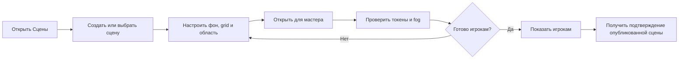
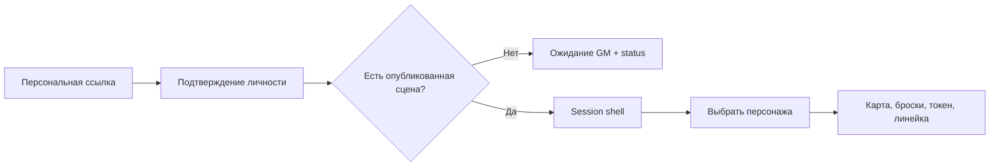
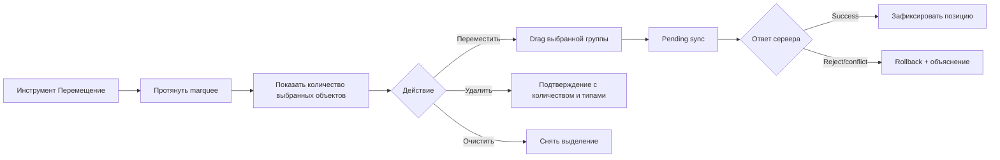
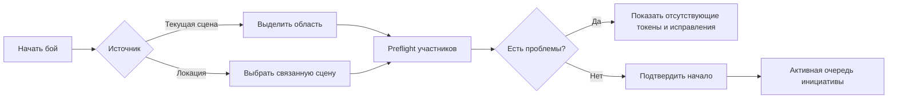
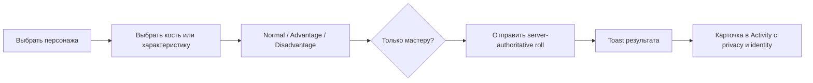

# Arken Space — функциональное ТЗ на интерфейс

**Версия:** 0.1

**Дата:** 20.08.2026

**Статус:** draft для согласования до создания новых макетов

**Точка отсчёта:** `main`, `HEAD 42c7ccc` + отдельно отмеченный незакоммиченный UI WIP

**Назначение:** зафиксировать состав, логику и состояния интерфейса Arken Space до продолжения работы в Pen/Pencil.

> **Internal — not for public/player export.** Документ описывает в том числе
> границы авторизации и player-safe projection. Не добавлять сюда access URL,
> membership ID или сырые diagnostics.
>
> Документ описывает целевую структуру интерфейса на основе уже реализованного продукта. Он не является разрешением на изменение production-кода или deploy. Текущий Pen-файл в рамках этого пула не изменяется.
>
> Исторический контекст подготовки: [checkpoint от 20.08.2026](./arken-space-interface-specification-checkpoint-2026-08-20.md).

---

## 1. Как читать документ

Для требований используются статусы:

- **Current** — подтверждено зафиксированным кодом на `HEAD 42c7ccc`.
- **WIP** — находится в текущем незакоммиченном рабочем дереве; макетировать можно, но нужно обозначать как незавершённое.
- **Design gap** — функция или контракт существует, но полноценного интерфейса ещё нет.
- **Decision needed** — требуется отдельное продуктовое решение до high-fidelity макетов.
- **Later** — намеренно не входит в ближайший дизайн-пул.

Источники среза:

- README и проектная документация;
- Git-история после baseline от 31.07.2026;
- текущие web-компоненты, контракты и тесты;
- предыдущие дизайн-решения пользователя в этой задаче;
- read-only аудит текущего dirty tree.

`docs/current-state.md` и часть свежих проектных документов сами входят в незакоммиченный пул. Поэтому источником правды для состава UI являются совместно Git-история, код и тестовые контракты, а не один markdown-файл.

---

## 2. Цель продукта и интерфейса

Arken Space — desktop-first виртуальное пространство для одной настольной ролевой кампании: GM управляет сценами и подготовкой, а до шести игроков взаимодействуют с общей картой, токенами, персонажами, бросками и событиями партии в реальном времени.

Интерфейс должен поддерживать два принципиально разных режима работы:

1. **Подготовка до игры.** GM создаёт и редактирует сцены, персонажей, токены, контент мира, карты, доступы и материалы.
2. **Проведение сессии.** Карта и текущий игровой контекст доминируют. Игроки главным образом бросают кубы, перемещают контролируемые токены, пользуются линейкой, читают свою карточку персонажа и реагируют на события. GM изредка вносит изменения, не покидая сессию.

### 2.1. Главная задача интерфейса

Во время игры пользователь должен понимать, **что происходит на сцене сейчас**, и выполнять следующее уместное действие без поиска по административным разделам.

### 2.2. Критерий успеха

- Игрок входит по персональной ссылке и начинает играть без обучения административной модели продукта.
- GM может открыть сцену безопасно для себя, отдельно опубликовать её игрокам и проводить игру, не смешивая подготовку и live-состояние.
- Карта остаётся доступной и читаемой при открытом sidebar и рабочих окнах.
- Состояние подключения, права, активный инструмент, выбранные объекты, опубликованная сцена и текущий бой визуально различимы.
- Частые действия требуют минимум переходов; редкие и рискованные действия раскрываются прогрессивно.

---

## 3. Роли и режимы доступа

### 3.1. GM

GM:

- выбирает сцену локально и отдельно публикует её игрокам;
- создаёт и настраивает сцены;
- видит все рабочие пространства, доступные его membership/capabilities;
- управляет grid, fog, слоями, размерами canvas и объектами карты;
- начинает бой из выбранной области текущей сцены или связанной сцены локации;
- формирует инициативу, добавляет токены и участников без токена, завершает бой;
- выбирает персонажа для бросков, управляет NPC и ресурсами;
- управляет персонажами, токенами, доступами, контентом мира, картами, медиа и заявками;
- может открыть безопасный режим «Посмотреть глазами игрока».

### 3.2. Игрок

Игрок:

- видит только опубликованную сцену и player-safe серверную проекцию;
- перемещает только контролируемые токены;
- создаёт и правит только разрешённые ему рисунки;
- использует перемещение/выделение, рисование, линейку и ping;
- открывает доступного персонажа, бросает характеристики/навыки/кубы и изменяет разрешённые ресурсы;
- вводит или бросает инициативу только для своей доступной строки;
- видит собственные или делегированные персонажи и токены;
- создаёт, редактирует и отменяет свои заявки GM;
- может безопасно передать общий компьютер следующему игроку.

### 3.3. GM preview

Режим «Глазами игрока» — не простое переключение темы и не подмена роли в UI. В текущей реализации он read-only и:

- использовать ту же player-safe проекцию, что и настоящий игрок;
- явно показывать persistent banner режима просмотра;
- содержать заметное действие «Вернуться к мастеру»;
- не оставлять GM-действия доступными через меню или shortcuts.

### 3.4. Operator feedback

Operator feedback — capability, а не отдельная игровая роль. Точка входа показывается только при наличии права. Этот раздел не должен влиять на основную GM/Player IA.

### 3.5. Объектные права

Доступ к конкретному персонажу или токену определяется ownership/controller membership. Нельзя проектировать интерфейс так, будто роль `PLAYER` автоматически даёт одинаковые права на все player-объекты.

### 3.6. Матрица видимости

| Возможность                            |            GM |          Player | GM preview |
| -------------------------------------- | ------------: | --------------: | ---------: |
| Выбрать сцену для локального просмотра |            Да |             Нет |        Нет |
| Опубликовать сцену                     |            Да |             Нет |        Нет |
| Видеть неопубликованную/GM-информацию  |            Да |             Нет |        Нет |
| Fog reveal/cover                       |            Да |             Нет |        Нет |
| Перемещать контролируемый токен        |            Да |              Да |        Нет |
| Бросать за доступного персонажа        |            Да |              Да |        Нет |
| Управлять инициативой целиком          |            Да |             Нет |        Нет |
| Вводить свою инициативу                |            Да |              Да |        Нет |
| Редактировать подготовительные данные  |            Да | Ограниченно/нет |        Нет |
| Создавать заявку GM                    |           Нет |              Да |        Нет |
| Operator feedback                      | По capability |   По capability |        Нет |

Недоступные из-за роли действия по умолчанию **не показываются**, а не остаются повсеместно disabled. Disabled используется только когда действие доступно роли, но временно невозможно из-за контекста.

---

## 4. UX-принципы

1. **Карта — основной контекст сессии.** Рабочие окна и sidebar не должны превращать session shell в обычную админ-панель.
2. **Подготовка и публикация — разные действия.** «Открыть для мастера» безопасно; «Показать игрокам» меняет общий live-контекст и требует более осторожной иерархии.
3. **Частые действия на поверхности, редкие — в раскрытии.** В игре видимы pan/select, ruler, ping, dice, character и события. Сложные настройки находятся в popover/workspace.
4. **Role-specific composition.** Player получает не урезанный GM-экран, а более простой игровой состав.
5. **Состояния не кодируются одним цветом.** Иконка, форма/рамка, текст и позиция дополняют цвет.
6. **Текстура не заменяет иерархию.** Богатый material layer применяется к крупным поверхностям; мелкие контролы остаются спокойными и читаемыми.
7. **Одна команда — один ясный результат.** Особенно для publish, delete, archive, handoff, encounter start/end и расходования ресурсов.
8. **Realtime должен быть объясним.** Pending, offline, reconnect, conflict и rollback — самостоятельные состояния интерфейса.
9. **Плотность управляется.** Sidebar, toolbar и панели имеют expanded/compact/collapsed варианты, а не уменьшаются бесконечно.
10. **Клавиатура ускоряет, но не является единственным входом.** Каждая shortcut-команда имеет видимый эквивалент и tooltip.

---

## 5. Информационная архитектура

### 5.1. Общая карта продукта

```text
Public
├─ Landing
├─ GM sign-in
├─ Beta player sign-in
├─ Invite sign-in
└─ Auth error / expired access

Authenticated session
├─ Session shell
│  ├─ Topbar
│  ├─ Map canvas + map chrome
│  ├─ Sidebar
│  │  ├─ Activity
│  │  └─ Story (GM current)
│  ├─ Token tray
│  ├─ Music
│  └─ Workspace windows / full-canvas workspaces
│
├─ Characters
├─ Tokens
├─ Scenes
├─ Setup
├─ World content manager
├─ World maps
├─ Player-safe codex
├─ Player requests
├─ Media/files
├─ Operator feedback (capability)
└─ Shortcuts reference (WIP)
```

### 5.2. Навигация GM — Current

1. Персонажи
2. Токены
3. Сцены
4. Подготовка
5. Энциклопедия мира
6. Карты мира
7. Энциклопедия
8. Открытые заявки
9. Operator feedback — только по capability
10. Файлы

Непоместившиеся пункты переходят в измеряемый overflow `Ещё N`. Порядок tab и arrow-key navigation должен совпадать с визуальным порядком.

### 5.3. Навигация Player — Current

1. Персонажи
2. Токены
3. Мои заявки

### 5.4. Player-safe знания — Current decision

UIX-472 намеренно скрывает «Файлы», «Карты мира» и обе энциклопедии из текущей Player navigation. Это продуктовая граница актуального интерфейса, а не незакрытый вопрос для ближайших макетов.

Player-safe backend projection для части данных сохраняется. Если позднее появится отдельная player surface или безопасная прямая ссылка, она должна использовать эту проекцию и не должна автоматически возвращать GM-разделы в основную навигацию.

### 5.5. Decision needed: два названия энциклопедии

«Энциклопедия мира» и «Энциклопедия» недостаточно различимы. В wireframe можно использовать технические уточнения:

- **Контент мира (GM)** — редактор сущностей, связей и медиа;
- **Кодекс (player-safe)** — опубликованное знание.

Финальные пользовательские названия нужно согласовать до UX-copy pass.

---

## 6. Каркас session shell

### 6.1. Композиция

Session shell состоит из четырёх устойчивых зон:

1. **Topbar** — кампания, сцена, разделы, музыка, состояние сессии.
2. **Canvas** — постоянный игровой контекст.
3. **Right sidebar** — действия и события текущей сессии.
4. **Contextual overlays** — toolbar, selection actions, zoom/layer controls, token tray, workspaces, dialogs и toast.

На desktop карта должна получать остаток пространства после topbar и sidebar. Нельзя резервировать пустые декоративные поля вокруг canvas за счёт полезной игровой площади.

### 6.2. Topbar

Обязательные зоны слева направо:

1. логотип/wordmark;
2. название кампании с GM-редактированием;
3. scene control;
4. adaptive workspace navigation;
5. музыка;
6. connection/account/session menu.

#### Scene control GM

- thumbnail сцены;
- название;
- количество токенов или другой краткий контекст;
- distinction между «просматривается мастером» и «показана игрокам»;
- безопасное действие «Открыть»;
- отдельное действие publish/show players;
- создание новой сцены.

Publish не должен выглядеть более безопасным и главным, чем локальное открытие. После публикации UI подтверждает, **какую сцену сейчас видят игроки**.

#### Scene control Player

- readonly active-scene label;
- отсутствие dropdown и publish/create;
- empty state, если GM ещё не опубликовал сцену.

### 6.3. Workspace presentation model

Есть два типа рабочих пространств:

- **Full-canvas workspace** — временно заменяет карту, когда нужен плотный редактор. Current: Characters, Setup, World Maps.
- **Workspace window** — открывается поверх карты и сохраняет игровой контекст. Остальные разделы.

Workspace window:

- имеет title, close и понятный drag area;
- получает focus при открытии и bring-to-front при взаимодействии;
- закрывается `Esc`, если нет более приоритетного вложенного overlay;
- не теряется за viewport и имеет reset position;
- не маскирует модальный confirm под обычное окно.

### 6.4. Sidebar

- Current resizable range: **280–600 px**.
- Есть устойчивое среднее состояние около 360 px.
- Sidebar сворачивается полностью и восстанавливается видимой affordance.
- Composer всегда остаётся доступным и не перекрывается scroll-контентом.
- Ширина меняет внутреннюю композицию через container-aware варианты, а не только уменьшение текста.

### 6.5. Сохранение пользовательских настроек

По участнику уже сохраняется часть layout preferences. Целевой набор:

- ширина/collapse sidebar;
- collapse map toolbar;
- compact/collapsed панели;
- выбранные фильтры Activity — **Design gap**, сейчас persistence не подтверждён;
- локальная громкость;
- в будущем — персональная accent theme.

---

## 7. Основные пользовательские сценарии

### 7.1. GM: подготовить и показать сцену



### 7.2. Игрок: войти и начать игру



### 7.3. Выбрать область и изменить несколько объектов



### 7.4. Начать бой из сцены



### 7.5. Игрок: бросок и приватность



---

## 8. Карта и игровые инструменты

### 8.1. Базовые инструменты

Для Player и GM:

- **Перемещение/выделение** (`V`, WIP shortcuts manifest);
- **Рисование** (`D`);
- **Линейка** (`R`);
- **Ping** (`P`);
- object list с role-safe проекцией объектов и действий.

Только GM:

- fog reveal/cover прямоугольником (`G` / `Shift+G`);
- fog reveal/cover кистью (`B` / `Shift+B`);
- fog reveal/cover полигоном (`L` / `Shift+L`);
- grid settings;
- canvas/background size mode;
- GM layer/fog opacity;
- encounter actions.

Shortcut dialog и tooltip labels относятся к **WIP**, пока пул не зафиксирован
в Git. Browser evidence хранится в `current-state.md` и техническом checkpoint.

### 8.2. Toolbar

GM toolbar группируется по смыслу, а не как длинная колонка одинаковых иконок:

- Туман;
- Метки;
- Прочее/настройки.

Для каждой команды:

- expanded вариант: icon + label + optional shortcut;
- compact вариант: icon + tooltip;
- hover, pressed, active tool, focus, disabled;
- active tool отличается от selected object и focus.

### 8.3. Выделение объектов

Поддержать:

- одиночный токен;
- одиночный рисунок;
- marquee по области;
- несколько объектов разных типов;
- token stack;
- clear selection;
- bulk move;
- bulk delete.

Selection action bar показывает количество и состав выбранного, а не только универсальные иконки. Bulk delete требует confirmation с понятным описанием последствия. Immediate delete рисунка допускается только при доступном undo и явном feedback.

### 8.4. Токен — Current и Target

Состояния токена:

- default / hover / selected / dragged / resizing;
- controlled / uncontrolled / locked;
- visible / hidden;
- MAP / PLAYER / GM layer;
- token stack;
- image loading / fallback initials / broken image;
- inherited character name / custom token name;
- optimistic move / rejected move;
- 1–4 simultaneous conditions.

Доступные GM-действия **Current**:

- resize на canvas;
- duplicate из списка объектов;
- смена слоя;
- базовый цвет и цвет рамки;
- delete;
- открытие связанного персонажа.

**Target / Design gap:** единая поверхность переименования, visibility toggle, управление наследованием имени и редактор состояний фигуры. Эти действия нельзя показывать в макете как уже собранное current-меню.

### 8.5. Design gap: редактор состояний фигуры

Контракт поддерживает закрытый набор:

- Отравлен;
- Без сознания;
- Обездвижен;
- Распластан.

На canvas уже предусмотрены цветные буквенные badges и текст при hover, но клиентского condition picker/editor нет. В дизайн требуется:

- точка входа из token context/details;
- multi-select списка состояний;
- icon + short label + full label;
- readable representation нескольких состояний на токене;
- отсутствие зависимости только от цвета;
- keyboard и touch target состояния.

### 8.6. Рисование

- palette цвета не перекрывает toolbar;
- stroke-width presets;
- draft / pending / persisted / rejected;
- ownership и permission;
- select / duplicate / delete / undo;
- длинная непрерывная линия не должна блокировать canvas interaction.

### 8.7. Линейка

- многосегментный путь;
- `Ctrl`/`Cmd` добавляет waypoint;
- дистанция подписана единицами grid;
- направление/arrowhead считывается на светлой и тёмной карте;
- clear/cancel доступны мышью и клавиатурой.

### 8.8. Fog

Нужны состояния:

- reveal/cover rectangle;
- reveal/cover brush;
- brush hover preview + radius control;
- reveal/cover polygon;
- polygon in progress / complete / cancel;
- server pending / rejection;
- GM view и player-safe результат.

Reveal и cover должны различаться не только цветом: icon, label, cursor/preview pattern.

### 8.9. Grid, camera и canvas

- zoom `+ / − / fit`;
- mouse wheel behavior;
- grid enabled, size, offset, color, opacity;
- размер по изображению или по области;
- resize handles и live preview;
- long-map/minimap decision можно отложить;
- отсутствие сцены и загрузка карты имеют отдельные states.

### 8.10. Cursor presence

- участники показываются с устойчивой идентификацией;
- GM управляет трансляцией своего курсора;
- присутствие не конкурирует с token/selection colors;
- stale cursor исчезает предсказуемо.

---

## 9. Бой и инициатива

### 9.1. Запуск

GM выбирает:

- область текущей сцены;
- связанную сцену локации.

Preflight показывает:

- выбранную область/сцену;
- найденных участников;
- player characters без токенов;
- возможные исправления;
- loading/error/retry.

### 9.2. Initiative panel — Current

- очередь сортируется сервером;
- изменение инициативы меняет порядок;
- GM добавляет выбранные токены;
- GM добавляет участника без токена;
- GM удаляет участника;
- Player видит только строки доступных ему персонажей и никогда не видит NPC/противников, независимо от fog;
- Player вводит или бросает свою инициативу;
- окончание боя очищает очередь;
- панель сворачивается.

### 9.3. Design gap: текущий ход

Текущая реализация хранит инициативу, но не моделирует полноценный active turn/next turn. Поэтому до макета управления ходом нужно решить:

- нужен ли current-turn marker;
- кто может переключать ход;
- требуется ли round counter;
- какие события уходят в Activity;
- что видит Player о противниках.

До решения нельзя изображать «Следующий ход» как уже существующую функцию.

### 9.4. Завершение боя

- отдельное destructive действие;
- подтверждение последствий;
- ясное указание, что очередь очистится;
- success/error feedback;
- возврат sidebar в out-of-battle composition.

---

## 10. Sidebar: Activity, броски, ресурсы и Story

### 10.1. Структура вкладок — Current

- GM: `События`, `Сюжет`;
- Player: только `События`;
- direct messages реализованы на уровне backend/старого UI, но видимая вкладка скрыта до отдельного редизайна.

В ближайших макетах вкладку «Личные» не показывать как текущую функцию.

### 10.2. Приоритет блоков Activity

**Во время боя:**

1. компактная инициатива;
2. выбор персонажа/quick roll;
3. dice mode и dice tray;
4. ресурсы;
5. фильтры и журнал;
6. composer.

**Вне боя:**

1. quick roll;
2. dice tray;
3. ресурсы;
4. фильтры и журнал;
5. composer.

Панели initiative, quick roll, resources и log могут сворачиваться независимо. Summary свёрнутого блока должен сохранять полезную информацию, а не только заголовок.

### 10.3. Быстрые броски

- GM выбирает персонажа;
- Player видит только доступных персонажей;
- число характеристик и навыков динамическое;
- `STAT` и `RESOURCE` — разные типы: resource нельзя визуально выдавать за кнопку броска;
- длинные пользовательские названия поддерживаются;
- группы сворачиваются;
- formula видима в tooltip/details, но не перегружает каждую кнопку.

### 10.4. Dice tray

Отдельные строки:

- кости `d2 / d4 / d6 / d8 / d10 / d12 / d20`;
- режим `Обычный / Преимущество / Помеха` как segmented radiogroup;
- режим **«Физические кубы»** с отдельным явным состоянием результата в Activity;
- custom formula;
- общий privacy control «Только мастеру».

Modifier keys:

- `Ctrl/Cmd` — временное преимущество;
- `Alt` — временная помеха.

Tooltip должен объяснять временный modifier и не создавать конфликт с browser/OS shortcuts.

### 10.5. Resources

Набор приходит из layout кампании и не фиксирован только на «Выносливость»/«Мана».

Resource counter:

- название;
- current / maximum;
- `−1`, numeric input, `+1`;
- regen/rest action, если разрешено правилами;
- zero / full;
- readonly;
- pending/coalesced update;
- rollback/conflict/offline;
- summary в collapsed state.

Manual input должен иметь явные границы и единицу/максимум. Нельзя полагаться на placeholder как label.

### 10.6. Activity filters

Категории Current:

- Броски;
- Сюжет;
- Справочные события.

Фильтры находятся под `⋯`, рядом показывается число скрытых категорий.

Пока Activity активна, read cursor продвигается только для включённых категорий
TABLE/STORY/ROLLS. Скрытая текущим фильтром категория сохраняет unread. Это не
означает persistence самих фильтров между reload: этот design gap остаётся
открытым.

Требование к будущему контролу:

- первым пунктом — **Все события**;
- далее отдельные switch/toggle rows категорий;
- состояние «ничего не показано» предупреждает, что лента скрыта фильтрами, и предлагает вернуть «Все»;
- checkbox без ясного checked-state не использовать;
- menu accessible как keyboard-operable popup.

### 10.7. Таксономия сообщений

В макетах нужны отдельные компоненты/варианты:

1. общий текст игрока/GM;
2. system/table event;
3. обычный roll;
4. critical success;
5. critical failure;
6. private-to-GM roll/message;
7. story update;
8. reference/codex event;
9. player request card;
10. image attachment;
11. sticker;
12. date separator;
13. avatar/token fallback.

Тип сообщения различается сочетанием **иконки, геометрии/рамки, заголовка и текста**, а не простой сменой accent color. Для small cards текстура минимальна.

### 10.8. Roll card

- token thumbnail или initials fallback;
- имя автора и персонажа;
- крупный результат;
- формула и bonus;
- режим advantage/disadvantage;
- critical state;
- privacy badge;
- timestamp;
- broken image state.

### 10.9. История и auto-follow

- если пользователь внизу, новые события продолжают follow-scroll;
- если он читает прошлое, позиция не сбрасывается;
- появляется кнопка/счётчик новых событий;
- есть loading older / end of history / retry;
- compact log не удаляет критически важную информацию.

### 10.10. Composer — Current и Target

**Current:**

- multiline input;
- `Enter` отправляет;
- `Shift+Enter` — новая строка;
- `Ctrl+Enter` — GM-private send;
- slash suggestions;
- sticker picker;
- «Только мастеру»;
- sending / error / retry;
- длинное сообщение и переполнение;
- disabled с объяснением при offline/no access.

**Target / отдельный scope:** image paste/upload непосредственно в Activity composer. Текущие media-пути относятся к Story и Direct; скрытый Direct UI нельзя выдавать за свойство общей ленты.

### 10.11. Story — Current GM surface

Состояния:

- empty;
- draft;
- published;
- corrected/updated;
- archived;
- media attachment;
- unread badge, если применимо;
- validation / publish pending / conflict.

Player Story-tab сейчас не входит в current navigation. Опубликованные доступные игроку STORY-сообщения уже доставляются через единую Activity feed. Отдельного решения требует только будущая самостоятельная Player Story surface, если она вообще понадобится.

---

## 11. Персонаж

### 11.1. Цели

**До игры:** GM создаёт и редактирует структуру, связи, медиа, доступ и каталоги.

**Во время игры:** Player быстро читает лист, бросает доступную характеристику/навык, меняет ресурс и открывает необходимые детали.

### 11.2. Состав

- character picker;
- identity: имя, портрет, базовая информация;
- controllers/access;
- dynamic stat groups;
- skills/abilities;
- resources;
- wallet;
- inventory;
- notes;
- media gallery;
- rest actions;
- token relation/creation;
- archive;
- GM hard delete как отдельный destructive flow.

### 11.3. Dynamic layout

GM может:

- добавлять строки в текущие фиксированные группы `characteristics` и `combat`;
- переименовывать;
- менять порядок;
- безопасно удалять.

Создание произвольных групп и явный выбор типа строки `STAT/RESOURCE` в текущем UI не подтверждены и остаются **Design gap**, если продукту понадобится такая модель.

Если строка используется зависимостями, delete state показывает список ссылок и не сводится к общей ошибке.

### 11.4. Catalog picker

- поиск;
- selected/unselected;
- empty/no results;
- inline create;
- validation duplicate;
- assigned state;
- keyboard navigation;
- длинные названия и описание.

### 11.5. Character access

- GM видит контроллеров и доступы;
- Player не видит административный список, если это не требуется для игры;
- unassigned player получает обучающий empty state;
- preview объясняет, от чьего лица открыт лист.

### 11.6. Визуальная плотность

Лист персонажа не должен быть сеткой из одинаковых карточек. Приоритет:

1. identity и актуальные игровые значения;
2. stats/resources;
3. skills/abilities;
4. inventory/notes/media;
5. административные GM-метаданные.

---

## 12. GM workspaces

Для каждого workspace обязательны: default/populated, empty, loading, edit, validation error, server error/retry, pending mutation, conflict и destructive confirmation, если есть удаление.

### 12.1. Сцены

- список/карточки сцен;
- current local vs published state;
- create;
- open for GM;
- show players;
- configure;
- empty/no image;

Archive/delete для сцен в текущем UI отсутствуют; не добавлять их в макет без отдельного продуктового решения.

### 12.2. Scene editor

- map upload или asset picker;
- width/height;
- grid enabled;
- grid size/offset/color/opacity;
- background frame;
- aspect lock;
- fit by image/area;
- unsaved/dirty;
- upload progress/error;
- conflict.

Поля opacity должны показывать понятную пользователю единицу или формат, а не необъяснённое `0–1`.

### 12.3. Подготовка

Текущие вкладки:

- Обзор;
- Персонажи и доступ;
- Общий каталог.

Функции:

- online players;
- rename player;
- «Посмотреть глазами игрока»;
- create character;
- token from character;
- personal access links: create/copy/rotate/revoke;
- catalog management;
- dynamic stat layout management.

Rotate/revoke и shared-PC handoff являются security-sensitive flows и требуют объяснения последствий.

### 12.4. Токены

- token definition list/card;
- image/asset picker;
- linked character;
- name inheritance;
- layer, size, colors;
- duplicate;
- destructive hard delete;
- empty state с созданием первого токена.

Archive для token definitions в текущем UI отсутствует.

Delete не оформлять как обычную нейтральную кнопку с danger-colored text внутри.

### 12.5. World maps

- lifecycle `DRAFT / PUBLISHED / ARCHIVED`;
- background assignment/approval;
- map/location editor;
- locations list/detail;
- GM notes;
- party position;
- linked scenes;
- start encounter;
- immutable published-map behavior;
- empty/no-map/loading/error.

### 12.6. World content manager

- сущности;
- связи;
- media;
- instance management;
- draft/published/player-safe states;
- list/detail/editor pattern;
- no-permission and projection preview.

### 12.7. Player-safe codex

- list/search/filter;
- category/navigation;
- entity details;
- related items;
- media;
- locked/unavailable/empty;
- distinction между «не опубликовано» и «ничего не найдено» без раскрытия секретных данных.

### 12.8. Player requests

Player:

- create;
- edit draft/open request;
- cancel;
- see status and linked response.

GM:

- queue/filter;
- open detail;
- act/update status;
- link/reflect request in Activity.

Неясный counter вроде «Открыто 1/3» должен сопровождаться объяснением лимита.

### 12.9. Target: Files/media

- asset list/grid;
- search/filter;
- image preview;
- upload/paste;
- progress/error/retry;
- missing/broken asset;
- selection mode;
- safe deletion references.

Выдача отдельного материала конкретному игроку **Later** и не входит в ближайший scope.

### 12.10. Operator feedback

- capability-gated list/detail;
- status/filter;
- source/context;
- no access;
- empty/loading/error;
- терминология должна быть локализована или сознательно унифицирована.

---

## 13. Public и auth

Нужны экраны:

1. Landing;
2. GM sign-in;
3. beta-player choice/sign-in;
4. invite sign-in с именем;
5. invalid/expired/revoked access;
6. pending/success/error public feedback form;
7. shared-PC player handoff.

Auth UI не раскрывает секреты и после успешного входа не оставляет access token в видимом URL.

Shared-PC handoff предупреждает, что текущая сессия будет завершена, и только после подтверждения показывает выбор следующего игрока/входа.

---

## 14. Системные и realtime-состояния

### 14.1. Connection

- online;
- reconnecting;
- resyncing;
- offline;
- stale revision;
- unrecoverable session/auth error.

Connection indicator открывает понятное объяснение: что происходит, сохранены ли локальные действия и что может сделать пользователь.

### 14.2. Mutation lifecycle

Для изменяемых данных:

```text
idle → optimistic/pending → success
                     └→ conflict → server value / retry
                     └→ failure → rollback / retry
```

Требования:

- pending не блокирует весь экран без необходимости;
- повторный клик не создаёт дубликат;
- rollback объясняет, что значение восстановлено сервером;
- conflict показывает актуальное значение и безопасное следующее действие;
- destructive action не применяется optimistic без recovery strategy.

### 14.3. Общий state inventory

- cold loading / skeleton;
- map loading;
- no scene;
- no published scene;
- empty list;
- no search results;
- permission denied;
- hidden by projection;
- disabled due to context;
- validation error;
- upload progress/error;
- server error/retry;
- success/warning/danger toast;
- conflict/rollback;
- offline/reconnect;
- broken image/fallback;
- long content/overflow;
- unsaved/dirty form.

---

## 15. Инвентарь дизайн-системы

Разработка идёт снизу вверх, но экранный контекст проверяется после каждого крупного пула.

### 15.1. Product semantics

- role: GM / Player / preview;
- access: owner / controller / readonly / hidden;
- privacy: table / GM-private;
- scene: local-viewed / published / inactive;
- encounter: none / preflight / active / ending;
- realtime: online / pending / conflict / reconnect / offline;
- action risk: safe / publish / destructive.

### 15.2. Foundations

- primitive → semantic → component tokens;
- typography;
- 4-point spacing scale;
- density modes;
- border/ornament scale;
- texture/material intensity tiers;
- focus/selection/active-tool system;
- z-layer scale для canvas DOM/workspaces/popovers/modals/toasts;
- motion and reduced-motion;
- theme accent layer.

### 15.3. Primitives

- text roles;
- icons;
- dividers;
- status/condition/unread/count/privacy badges;
- avatar/token thumbnail/fallback;
- dice glyph;
- shortcut key `kbd`;
- focus ring;
- selection outline;
- resize/drag handles;
- loading indicator;
- image placeholder.

### 15.4. Base controls

- text/password/search/number input;
- textarea/composer;
- select;
- rich scene picker;
- combobox/catalog picker;
- checkbox where semantically required;
- switch/toggle row;
- segmented/radiogroup;
- range slider;
- numeric stepper/resource counter;
- color swatch/input;
- file/image upload and paste;
- buttons: primary, secondary, flat, icon, destructive;
- split/action button;
- tabs;
- disclosure/summary;
- menu item/menu radio/menu switch;
- tooltip with shortcut;
- inline link;
- form label/help/error/status.

Каждый control: default, hover, pressed, focus-visible, selected/checked, disabled, loading и error, где применимо.

### 15.5. Navigation and shell

- wordmark/logo;
- campaign rename;
- scene picker + publication status;
- workspace nav item;
- `Ещё N` overflow;
- music controller;
- connection indicator;
- account/session menu;
- sidebar collapse/restore;
- resize handle;
- workspace header;
- responsive toolbar group.

### 15.6. Canvas domain

- map tool button/group;
- fog mode/radius;
- cursor presence;
- grid and canvas popovers;
- undo/redo;
- zoom and GM-layer control;
- object list/row actions;
- marquee;
- selection action bar;
- token/frame/fallback/condition strip/stack;
- token hover label/resize/context menu;
- drawing palette/stroke presets;
- ruler/ping/fog previews;
- token tray and draggable item;
- encounter region and preflight.

### 15.7. Sidebar/game domain

- Activity/Story tab;
- event filter menu;
- message taxonomy;
- roll result/avatar/privacy/critical;
- story/reference/request cards;
- composer/sticker/slash menu;
- new-events action;
- roll toast;
- dice tray/mode/formula;
- quick-roll chip/group;
- resource counter;
- initiative row/list/actions.

### 15.8. Workspace domain

- character identity/stat/resource/skill/inventory/wallet/media/access;
- token definition;
- scene card/editor;
- asset picker;
- request card/status;
- world map/location;
- world entity/relation/media;
- story editor;
- operator feedback list/detail;
- media library item.

### 15.9. Overlays and feedback

- standard modal;
- draggable workspace window;
- confirm dialog;
- text prompt;
- encounter method/location/preflight;
- player handoff warning;
- shortcuts reference;
- dropdown/popover/context menu;
- toast/banner;
- empty/loading/error/conflict blocks.

---

## 16. Визуальное направление как ограничение, не как готовый макет

### 16.1. Базовое направление

- dark fantasy, с ощущением физического игрового интерфейса;
- ориентир по уровню выразительности — RPG-интерфейсы уровня Baldur’s Gate 3 и отобранные пользователем dark-fantasy UI references;
- не копировать защищённые ассеты/конкретные элементы один в один;
- основной ближайший theme pilot: **золото + тёплый коричневый/графит**;
- структура и контраст не зависят от темы.

### 16.2. Геометрия

- крупные панели могут иметь аккуратно срезанные углы, вложенную рамку и один контролируемый декоративный мотив;
- мелкие controls используют упрощённую геометрию того же семейства;
- углы не наезжают друг на друга;
- декоративная рамка не уменьшает hit area;
- кнопки не сводятся к одинаковым plain rectangles, но сохраняют ясную иерархию.

### 16.3. Текстуры и shaders

Три уровня интенсивности:

1. **Large surfaces** — заметная, но тёмная текстура материала, мягкая неоднородность, глубина.
2. **Panels/cards** — сдержанная текстура и локальный edge treatment.
3. **Small controls** — почти плоская поверхность; texture/noise только как микроуровень.

Шум не может быть светлее основного содержимого и не должен создавать «кашу» в кнопках, chips, inputs и карточках сообщений.

### 16.4. Типографика

- display и operational text разделяются;
- ранее обсуждённая пара требует повторной проверки на реальном актуальном экране, а не считается production-фактом;
- body/control text должен поддерживать кириллицу, плотный sidebar и длинные пользовательские названия;
- декоративный display font не применяется к числам ресурсов, формулам и мелким controls.

### 16.5. Темы

Later планируются персональные accent themes: красная, синяя, фиолетовая, зелёная и базовая золотисто-коричневая.

Темы меняют:

- semantic accent;
- controlled glow/material tint;
- selected/focus accents в допустимых пределах.

Темы не меняют:

- структуру;
- смысл danger/success/warning;
- размер и геометрию компонентов;
- контрастность;
- role/privacy semantics.

### 16.6. Логотип

На ближайшем этапе используется ранее выбранный первый portal visual как временный asset. Его точная переработка и интерактив с случайным числом внутри остаются отдельной задачей. Не упрощать эмблему до sci-fi символа и не строить вокруг неё текущий functional wireframe.

---

## 17. Accessibility и keyboard

### 17.1. Базовые требования

- WCAG AA: 4.5:1 обычный текст, 3:1 крупный текст и значимые графические элементы;
- focus-visible различим на всех surface tiers;
- target size не менее 40×40 px для частых icon actions, предпочтительно 44×44 в просторных режимах;
- цвет не единственный носитель смысла;
- все поля имеют persistent label;
- error связывается с полем программно; требуется единая модель `aria-invalid`/description;
- dialog имеет focus trap, initial focus, return focus и Escape behavior;
- dynamic feed имеет аккуратную live-region strategy без озвучивания каждой realtime мелочи;
- reduced motion поддерживается.

### 17.2. Keyboard model

- `Tab` идёт по видимым контролам в логичном visual order;
- arrow keys используются внутри tabs/radiogroups/menus;
- `Esc` сначала закрывает ближайший overlay. Для object list первый `Esc`
  закрывает список и возвращает focus на trigger без очистки selection, а
  следующий `Esc` очищает map selection/draft;
- `Delete` действует только при валидном selection и не должен удалять контент из input;
- shortcuts не срабатывают при наборе текста;
- shortcuts reference фильтруется по роли;
- каждый shortcut имеет discoverable tooltip/menu entry.

### 17.3. Canvas accessibility

Альтернативный DOM-список объектов карты позволяет выбирать объекты и выполнять
разрешённые действия без точного pointer input. Object list отражает selection и
permissions; его закрытие не должно неявно сбрасывать выбранные объекты.

---

## 18. Адаптивность

### 18.1. Целевые viewport

- **1920×1080** — расширенный desktop;
- **1440×900** — основной дизайн-baseline;
- **1280×800** — compact desktop;
- **1100×900** — проверка nav overflow и плотного sidebar;
- **960 px width** — текущая нижняя граница полноценного session shell;
- **390×844** — только проверка доступности входа, ошибок и критических session actions; полноценный mobile tactical canvas не входит в этот scope.

### 18.2. Правила

- topbar сначала переводит разделы в `Ещё`, затем упрощает второстепенные labels;
- scene state и connection state не исчезают;
- sidebar адаптирует внутренние компоненты к ширине 280–600 px;
- workspace window при `<768 px` переходит в full-screen sheet/page behavior;
- tool labels могут уходить в tooltip-only compact mode;
- критические действия не скрываются без альтернативной точки входа;
- полный mobile redesign — отдельный scope, так как runtime сейчас desktop-first и имеет `min-width: 960px`.

---

## 19. UX-copy

### 19.1. Правила

- кнопка: глагол + объект (`Открыть сцену`, `Показать игрокам`, `Завершить бой`);
- status отвечает на вопрос «что сейчас происходит»;
- error: что случилось + что можно сделать;
- disabled action имеет tooltip/hint с причиной;
- избегать внутренних ключей и англоязычных названий без продуктовой необходимости.

### 19.2. Обязательные copy fixes на дизайн-этапе

- локализовать/переименовать `Operator feedback`;
- заменить `gold / silver / copper / sp` пользовательскими названиями и единицами;
- развести два пункта энциклопедии;
- объяснить opacity/grid units;
- объяснить лимит в counters типа «Открыто 1/3»;
- явно различить локально открытую и опубликованную сцену;
- сформулировать conflict/rollback/offline messages.

---

## 20. Порядок создания макетов после согласования ТЗ

### Pool 1. Functional grayscale baseline

- актуальный 1440×900 GM Run;
- актуальный 1440×900 Player Run;
- shell states: sidebar widths/collapse, toolbar expanded/collapsed, nav overflow;
- battle/no-battle composition;
- selection/region flow;
- без texture/shader и без преждевременной декоративной детализации.

**Gate:** все функции и роли находятся на ожидаемых местах.

### Pool 2. Foundations and controls

- product semantics;
- spacing/density/type;
- buttons, icon buttons, inputs, switches, segmented controls, menus, tabs, disclosures;
- focus/selection/disabled/pending/error;
- проверка в реальном shell.

**Gate:** controls различимы, доступны и не выглядят как случайная смена цвета.

### Pool 3. Frame geometry

- family крупных рамок;
- упрощённые варианты small/compact;
- button silhouettes;
- углы, стыки и вложенные линии;
- без texture noise.

**Gate:** нет пересечений, перегруженных углов и декоративной каши.

### Pool 4. Palette and material

- gold/brown pilot;
- surface hierarchy;
- three-tier texture intensity;
- controlled shaders/noise;
- contrast and focus recheck.

**Gate:** large panels выразительны, small controls остаются чистыми.

### Pool 5. Domain components

- map tools/tokens/conditions/selection;
- dice/resources/initiative;
- Activity message taxonomy;
- scene/character/workspace components.

**Gate:** компоненты покрывают state matrix и реальные данные.

### Pool 6. Full screen set and QA

- GM and Player screens;
- prep workspaces;
- loading/empty/error/modal states;
- comparison with current local runtime;
- corrections and handoff notes.

---

## 21. Обязательный набор макетов

### 21.1. Baseline screens

- Landing/auth variants;
- GM Run — out of battle;
- GM Run — active battle;
- Player Run — out of battle;
- Player Run — active battle;
- GM preview;
- no published scene;
- reconnect/offline;
- compact 1100 px shell.

### 21.2. Map states

- default map;
- toolbar expanded/collapsed;
- draw/ruler/ping;
- three fog geometries reveal/cover;
- single token/drawing;
- multi-selection + move/delete;
- token stack/conditions/context menu;
- encounter region + preflight;
- object list;
- empty/loading map.

### 21.3. Sidebar states

- Activity no battle;
- Activity battle;
- quick rolls;
- dice tray/modes/privacy;
- resources expanded/collapsed/pending/error;
- initiative GM/Player;
- filters all/partial/none;
- long history/new events;
- message variants;
- composer/slash/sticker/error;
- Story states.

### 21.4. Workspaces

- Characters;
- Tokens;
- Scenes/editor;
- Setup/access/catalog/layout;
- World maps/location;
- World content manager;
- player-safe codex;
- Requests GM/Player;
- Files/media;
- Operator feedback by capability;
- shortcuts reference.

### 21.5. System/overlay

- confirm destructive;
- publish confirmation/state;
- handoff warning;
- upload progress/error;
- conflict/rollback;
- empty/loading/error/retry;
- no permission;
- toast stack;
- broken asset/fallback.

---

## 22. Acceptance criteria для дизайн-этапа

Макеты можно считать готовыми к валидации, если:

1. Есть явная role matrix GM/Player; capability Operator вынесен отдельно.
2. Не используются устаревшие паттерны: dropdown-only workspace nav, canvas dice overlay, fixed stats, visible direct-chat tab, rectangle-only fog, fixed sidebar.
3. Показаны functional states `default / hover / pressed / focus / selected / disabled / loading / error`.
4. Для realtime-команд показаны `pending / conflict / rollback / reconnect`.
5. Toolbar имеет expanded/collapsed варианты, группы, active tool и shortcut tooltip.
6. Sidebar проверен при 280, среднем, 600 px и collapsed; composer не перекрывается.
7. Area selection поддерживает bulk move/delete и clear; delete сообщает состав и количество.
8. Encounter/initiative появляются только в уместном контексте; действия GM и Player различаются.
9. Stats поддерживают произвольное число строк и длинные подписи; `STAT` и `RESOURCE` имеют разные компоненты.
10. Activity покрывает все указанные message variants и различает их не только цветом.
11. Token conditions не передаются одним цветом и имеют design для editor.
12. Publish/destructive действия не маскируются под безопасные primary actions.
13. Каждое поле имеет label, unit/hint, error и объяснение disabled-state.
14. Есть loading, empty, error/retry и permission states основных workspaces.
15. 1440×900 является основным baseline; 1920, 1280, 1100 и 960 проверены.
16. Тема, рамки и текстуры не ухудшают focus ring, контраст и чтение плотных контролов.
17. Мелкие controls используют упрощённый material treatment, а не уменьшенную копию богатой рамки.
18. Макеты сравнены с запущенным локальным сервисом на том же revision/dirty-tree snapshot.

---

## 23. Открытые решения до high-fidelity

| Вопрос                                            | Почему блокирует                  | Рекомендуемый следующий шаг                |
| ------------------------------------------------- | --------------------------------- | ------------------------------------------ |
| Как называется GM content manager и player codex? | Сейчас два похожих названия       | UX-copy mini-workshop                      |
| Как редактируются token conditions?               | API есть, UI отсутствует          | Спроектировать context entry + picker      |
| Нужен ли current turn/round control?              | Initiative пока только сортировка | Отдельное продуктовое решение              |
| Как возвращать direct messages?                   | Backend есть, UI скрыт            | Не включать до отдельного flow             |
| Какая точная типографика?                         | Ранее был лишь дизайн-кандидат    | Проверить 2–3 пары на реальном shell       |
| Как сохраняются персональные темы?                | Later feature                     | Специфицировать после gold/brown pilot     |
| Как работает portal/random-number logo?           | Не влияет на core UX              | Отдельная branding/microinteraction задача |

---

## 24. Out of scope ближайшего пула

- изменение production-кода;
- production deploy;
- создание или изменение Pen-макетов до согласования этого ТЗ;
- полноценный mobile tactical UI;
- выдача отдельного материала конкретному игроку;
- возврат direct-message UI;
- финальная перерисовка логотипа;
- финальная реализация всех персональных тем;
- выдумывание next-turn/round mechanics без продуктового решения.

---

## 25. Следующий gate

После согласования документа:

1. повторно открыть Pen Desktop;
2. зафиксировать revision и dirty-tree fingerprint;
3. запустить локальный сервис;
4. собрать визуальный baseline GM и Player;
5. создать в Pen **functional grayscale baseline** актуального интерфейса;
6. только после функционального sign-off перейти к controls, рамкам, palette и material layer по пулам из раздела 20.
